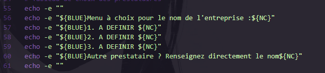
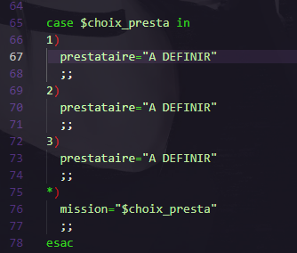

```
  ███████╗██╗██████╗ ███████╗███████╗ ██████╗
  ╚══███╔╝██║██╔══██╗██╔════╝██╔════╝██╔════╝
    ███╔╝ ██║██████╔╝███████╗█████╗  ██║     
   ███╔╝  ██║██╔═══╝ ╚════██║██╔══╝  ██║     
  ███████╗██║██║     ███████║███████╗╚██████╗
  ╚══════╝╚═╝╚═╝     ╚══════╝╚══════╝ ╚═════╝ Developped by 0xCookie
```
## Objectif

L'objectif de ce projet est d'automatiser le procéssus de création de Livrable en lui indiquant les fichiers que 
l'auditeur voudrais archiver et chiffrer afin de pouvoir envoyer les documents que le clients se doit de recevoir.

---

## Usage

```
./zipsec.sh --help

Ce script a pour utilité finale de chiffrer les fichiers clients et les archiver en ZIP automatiquement

Utilisation : ./zipsec.sh <fichier1> <fichier2> <fichier3> 

exemple : ./zipsec.sh rapport.pdf tableau.xlsx restitution.pptx
```
---

## Installation du script

```bash
    cd ~ 
    mkdir tools 
    cd tools 
    git clone https://github.com/0xCokieee/ZipSec
```
---

## Ajouter le script dans votre PATH (optionnel)

```bash
# Pour BASH :
echo 'export PATH="$PATH:~/tools/ZipSec/"' >> ~/.bashrc && source ~/.bashrc

# Pour ZSH:
echo 'export PATH="$PATH:~/tools/ZipSec/"' >> ~/.zshrc && source ~/.zshrc  
```
---

## Modification de quelque variable (Nécessaire)

[](./webhook_slack.png)
[](./txt_presta.png)
[](./var_presta.png)

---

Autor: 0xCookie
